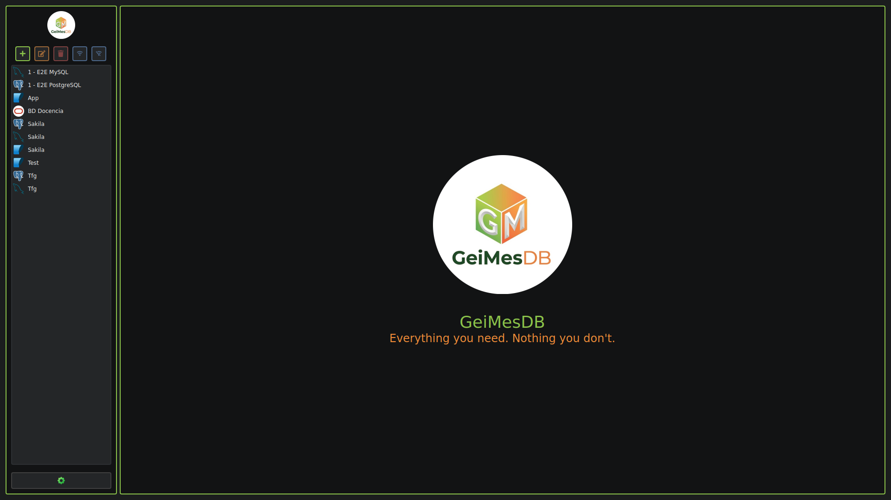
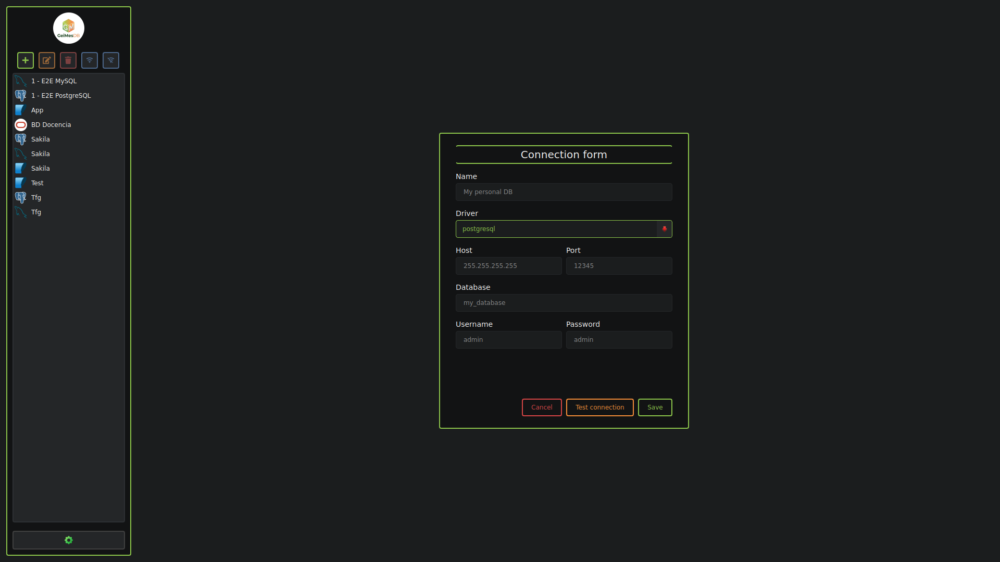
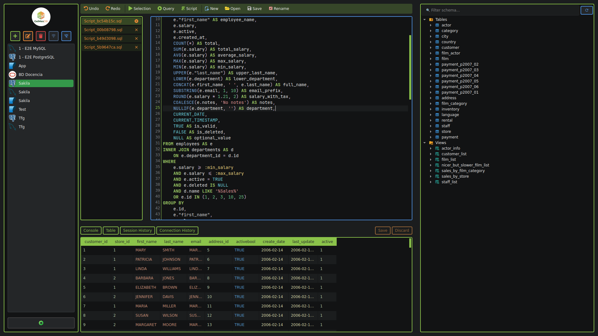
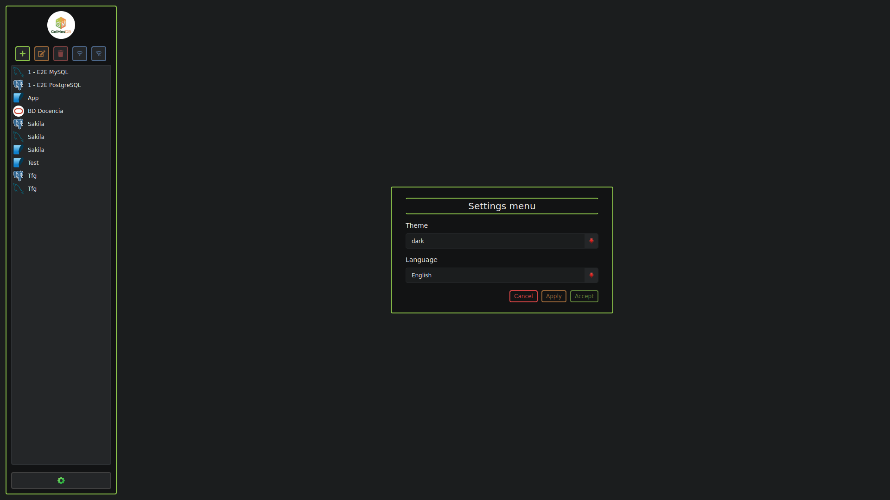

# TFG-GEI-MES-GeiMesDB

## Índice

- [TFG-GEI-MES-GeiMesDB](#tfg-gei-mes-geimesdb)
  - [Índice](#índice)
  - [Descripción del proyecto](#descripción-del-proyecto)
  - [Características principales](#características-principales)
  - [Tecnologías utilizadas](#tecnologías-utilizadas)
    - [Sistema operativo](#sistema-operativo)
    - [Lenguaje y framework](#lenguaje-y-framework)
    - [Base de datos](#base-de-datos)
    - [Herramientas de desarrollo](#herramientas-de-desarrollo)
    - [Testing y calidad del código](#testing-y-calidad-del-código)
    - [Generación del ejecutable](#generación-del-ejecutable)
    - [Cifrado y seguridad](#cifrado-y-seguridad)
    - [Icono del ejecutable de la aplicación](#icono-del-ejecutable-de-la-aplicación)
  - [Requisitos previos](#requisitos-previos)
    - [Windows](#windows)
    - [Linux](#linux)
  - [Instalación](#instalación)
    - [Compilación manual mediante el código fuente](#compilación-manual-mediante-el-código-fuente)
    - [Instalación mediante ejecutable](#instalación-mediante-ejecutable)
    - [Windows](#windows-1)
    - [Linux](#linux-1)
  - [Configuración](#configuración)
  - [Uso](#uso)
    - [Logs](#logs)
    - [Ejecución](#ejecución)
      - [Con terminal](#con-terminal)
      - [Sin terminal](#sin-terminal)
  - [Estructura del proyecto](#estructura-del-proyecto)
  - [Base de datos y logs](#base-de-datos-y-logs)
    - [Estructura](#estructura)
    - [Base de datos](#base-de-datos-1)
    - [Logs](#logs-1)
  - [Capturas de pantalla / ejemplos](#capturas-de-pantalla--ejemplos)
  - [Autor](#autor)
  - [Licencia](#licencia)

## Descripción del proyecto

**GeiMesDB** es una aplicación de escritorio orientada a la interacción, administración y gestión de **bases de datos relacionales**.

El principal objetivo del proyecto es ofrecer una herramienta **sencilla, clara y fácil de utilizar**, centrada en las funcionalidades habituales para trabajar con bases de datos relacionales. Se busca evitar la incorporación de funcionalidades poco comunes o de uso poco frecuente que puedan añadir complejidad innecesaria a la aplicación.

De esta forma, GeiMesDB apuesta por una experiencia de uso directa, manteniendo el foco en las tareas esenciales de administración y trabajo con bases de datos.

## Características principales

- **Gestión de bases de datos relacionales**
  Permite interactuar con bases de datos relacionales de forma sencilla y centralizada.
- **Interfaz gráfica intuitiva**
  Diseñada para facilitar el trabajo con bases de datos sin añadir complejidad innecesaria.
- **Consulta y manipulación de datos**
  Permite consultar, insertar, modificar y eliminar información de las bases de datos.
- **Gestión de estructuras**
  Permite trabajar con los diferentes elementos que componen una base de datos relacional.
- **Gestión de conexiones**
  Permite configurar y administrar las conexiones con las bases de datos.
- **Seguridad de credenciales**
  Protección y almacenamiento seguro de las credenciales utilizadas para las conexiones.
- **Sistema de logs**
  Registro de la actividad de la aplicación para facilitar el seguimiento y diagnóstico de posibles problemas.
- **Simplicidad como principio de diseño**
  La aplicación se centra en las funcionalidades habituales, evitando características poco comunes que puedan dificultar su uso.

## Tecnologías utilizadas

### Sistema operativo

- **Linux Mint Cinnamon** — Sistema operativo utilizado como entorno principal de desarrollo.

### Lenguaje y framework

- **Python 3.12.12** — Lenguaje principal utilizado para el desarrollo de la aplicación.
- **Qt** — Framework utilizado para el desarrollo de la aplicación.
- **Qt Widgets** — Módulo de Qt utilizado para desarrollar la interfaz gráfica.
- **PySide6** — Bindings de Qt para Python.

### Base de datos

- **SQLite** — Sistema de base de datos utilizado por la aplicación.
- **SQLAlchemy** — ORM utilizado para la gestión y comunicación con la base de datos.

### Herramientas de desarrollo

- **Visual Studio Code** — Entorno de desarrollo utilizado para programar y gestionar el proyecto.
- **Git** — Sistema de control de versiones utilizado para realizar el seguimiento de los cambios del proyecto.
- **GitHub** — Plataforma utilizada para alojar y gestionar el repositorio del proyecto.

### Testing y calidad del código

- **pytest** — Framework utilizado para las pruebas automatizadas.
- **pytest-qt** — Herramienta para realizar pruebas sobre componentes Qt.
- **pytest-cov** — Utilizado para medir la cobertura de las pruebas.
- **pytest-mock** — Soporte para el uso de mocks durante las pruebas.
- **Black** — Formateador automático de código Python.
- **isort** — Herramienta utilizada para organizar los imports.

### Generación del ejecutable

- **PyInstaller** — Utilizado para empaquetar la aplicación y generar el ejecutable distribuible.

### Cifrado y seguridad

- **cryptography** — Librería utilizada para las funcionalidades de cifrado y protección de información sensible.
- **keyring** — Gestión segura de credenciales y claves almacenadas en el sistema.
- **SecretStorage** — Almacenamiento seguro de información sensible mediante los servicios de credenciales del sistema.

### Icono del ejecutable de la aplicación

> [!INFO]
>
> **Pillow** se utilizó únicamente durante el desarrollo para convertir el icono de la aplicación al formato `.ico`. No forma parte de las dependencias de la aplicación y, por tanto, no se incluye en `requirements.txt`.
>
> ```bash
> pip install Pillow
> ```

## Requisitos previos

GeiMesDB se distribuye como un ejecutable independiente generado mediante **PyInstaller**, por lo que **no es necesario instalar Python ni las dependencias del proyecto** para utilizar la aplicación.

Los requisitos dependen del sistema operativo:

### Windows

- Windows 10 o superior.

### Linux

- Una distribución Linux compatible, como **Ubuntu** o **Linux Mint**.
- No es necesario instalar Python para ejecutar el ejecutable generado.
- Es necesario disponer de los permisos necesarios para ejecutar el archivo.

  > [!INFO]
  >
  > Se ha probado en distribuciones basadas en Debian, pero en principio debería funcionar en cualquier otra distribución Linux.

> [!WARNING]
>
> El ejecutable generado por PyInstaller es específico del sistema operativo para el que se ha realizado la compilación.

## Instalación

### Compilación manual mediante el código fuente

Si deseas compilar GeiMesDB manualmente a partir del código fuente, puedes usar el código de la [rama main](https://github.com/ViJoel/TFG-GEI-MES-GeiMesDB/tree/main) o usar los [tags](https://github.com/ViJoel/TFG-GEI-MES-GeiMesDB/tags) de las diferentes versiones de la aplicación (utiliza el tag con la última versión).

Consulta las instrucciones correspondientes a tu sistema operativo:

- [Windows](doc/Dist/Source/Windows.md)
- [Linux](doc/Dist/Source/Linux.md)

### Instalación mediante ejecutable

GeiMesDB puede utilizarse directamente a partir del ejecutable generado para el sistema operativo correspondiente.

Las versiones compiladas de GeiMesDB están disponibles en la sección de [Releases](https://github.com/ViJoel/TFG-GEI-MES-GeiMesDB/releases).

Descarga el ejecutable correspondiente a tu sistema operativo.

### Windows

1. Descarga el ejecutable.
2. Crea una carpeta destinada a GeiMesDB.
3. Coloca `GeiMesDB.exe` dentro de dicha carpeta.
4. Ejecuta `GeiMesDB.exe`.

También puedes crear un acceso directo al ejecutable para facilitar su ejecución.

### Linux

1. Descarga el ejecutable.
2. Crea una carpeta destinada a GeiMesDB.
3. Coloca el archivo `GeiMesDB` dentro de dicha carpeta.
4. Concede permisos de ejecución al archivo:

   ```bash
   chmod +x GeiMesDB
   ```

5. Ejecuta la aplicación:

   Puedes ejecutarlo desde la terminal:

   ```bash
   ./GeiMesDB
   ```

   o haciendo doble click sobre el ejecutable.

> [!IMPORTANT]
>
> Se recomienda mantener el ejecutable dentro de una carpeta dedicada exclusivamente a GeiMesDB, ya que la aplicación genera archivos de datos y logs en directorios situados junto al ejecutable.

## Configuración

GeiMesDB no requiere una configuración adicional antes de su primera ejecución.

Al iniciar la aplicación, se crean automáticamente los archivos y directorios necesarios para su funcionamiento.

La información generada por la aplicación se almacena junto al ejecutable:

```text
Carpeta/
├── GeiMesDB
├── geimesdb_data/
│   └── app.db
└── geimesdb_logs/
    └── app.log
```

La configuración de las conexiones con las bases de datos se realiza desde la propia aplicación.

> [!IMPORTANT]
>
> No se recomienda modificar manualmente los archivos contenidos en `geimesdb_data/` ni `geimesdb_logs/`, ya que son gestionados por GeiMesDB.

## Uso

Una vez instalada, GeiMesDB puede ejecutarse directamente mediante el ejecutable correspondiente al sistema operativo.

Al iniciar la aplicación, GeiMesDB comprueba automáticamente la existencia de los archivos necesarios para su funcionamiento. Si alguno de ellos no existe, la aplicación lo genera automáticamente.

Los archivos utilizados por la aplicación se almacenan en directorios situados junto al ejecutable:

```text
Carpeta/
├── GeiMesDB
├── geimesdb_data/
│   └── app.db
└── geimesdb_logs/
    └── app.log
```

> [!IMPORTANT]
>
> Se recomienda mantener el ejecutable y los directorios `geimesdb_data/` y `geimesdb_logs/` juntos en una misma carpeta. Si el ejecutable se mueve a otra ubicación, la aplicación generará los archivos necesarios en la nueva ubicación.

### Logs

La aplicación registra su actividad durante cada ejecución en el archivo:

```text
geimesdb_logs/app.log
```

El usuario puede consultar este archivo para revisar los mensajes y eventos registrados durante la **última ejecución de la aplicación**.

El archivo de logs se **sobrescribe cada vez que se inicia GeiMesDB**, por lo que únicamente contiene los registros correspondientes a la ejecución más reciente.

### Ejecución

#### Con terminal

En Windows **PowerShell**, ejecuta:

```powershell
& ".\GeiMesDB.exe"
```

En Linux:

```bash
./GeiMesDB
```

#### Sin terminal

Haz doble click sobre el ejecutable.

## Estructura del proyecto

La estructura principal del proyecto es la siguiente:

```text
GeiMesDB/
├── .github/            # Archivos de configuración de cosas de GitHub.
├── .vscode/            # Configuración de Visual Studio Code.
├── compile/            # Scripts de compilación.
├── doc/                # Documentación del proyecto.
├── Icon/               # Icono del ejecutable de la aplicación.
├── src/                # Código fuente de la aplicación.
├── tests/              # Pruebas automatizadas.
├── .gitignore          # Archivos y directorios ignorados por Git.
├── LICENSE             # Licencia del proyecto.
├── pytest.ini          # Configuración de pytest.
├── README.md           # Documentación principal del proyecto.
└── requirements.txt    # Dependencias del proyecto.
```

## Base de datos y logs

La aplicación utiliza **SQLite** como sistema de gestión de base de datos y dispone de un archivo de logs para registrar la actividad de la aplicación.

Ambos recursos son **generados automáticamente por la aplicación**. Cada vez que se inicia GeiMesDB, se comprueba la existencia de los archivos necesarios. Si alguno de ellos no existe, la aplicación se encarga de crearlo automáticamente.

### Estructura

Los archivos se encuentran organizados de la siguiente manera respecto al directorio del ejecutable:

```text
Carpeta/
├── ejecutable
├── geimesdb_data/
│   └── app.db
└── geimesdb_logs/
    └── app.log
```

### Base de datos

El archivo `app.db` contiene la base de datos SQLite utilizada por GeiMesDB.

- **Ubicación:** `geimesdb_data/app.db`
- Se genera automáticamente si no existe.
- La aplicación comprueba su existencia cada vez que se inicia.

### Logs

El archivo `app.log` almacena los registros generados durante la ejecución de la aplicación.

- **Ubicación:** `geimesdb_logs/app.log`
- Se genera automáticamente si no existe.
- Al iniciar la aplicación, el contenido anterior del archivo se **elimina y se sobrescribe**, comenzando un nuevo registro para la ejecución actual.

## Capturas de pantalla / ejemplos









## Autor

$✦$ $Víctor$ $Jöel$ $Viejo$ $Álvarez$ $✦$

## Licencia

Este proyecto está bajo la **Licencia MIT**.

Puedes consultar el texto completo de la licencia en el archivo [`LICENSE`](LICENSE) incluido en este repositorio.

La Licencia MIT permite utilizar, copiar, modificar, fusionar, publicar, distribuir, sublicenciar y vender copias del software, siempre que se mantenga el aviso de copyright y la licencia original.
